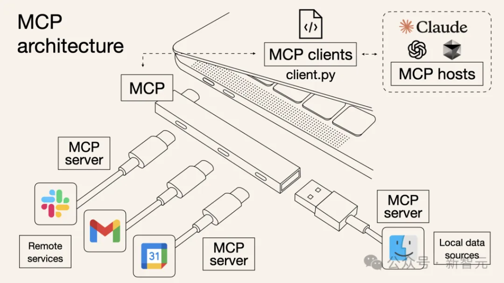
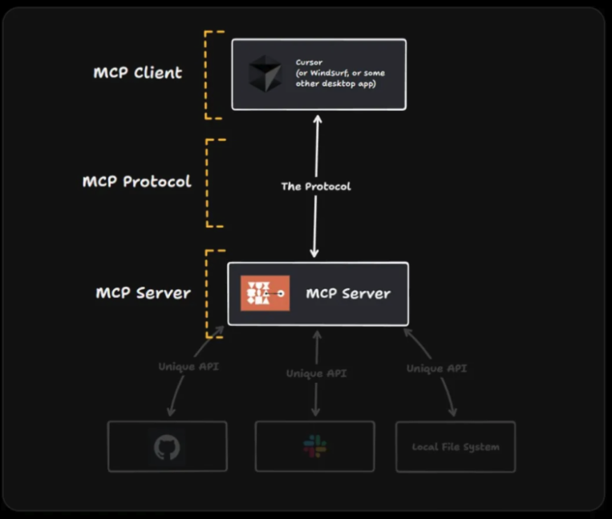

Title: 从API引申到MCP协议
Slug: future-aigc-mcp
Date: 2025-03-14 11:08
Category: 人工智能
Tags: blog,aigc,llm

# MCP协议详解
MCP（Model Context Protocol）是一种新的开放协议，目的是为LLM提供标准化的上下文信息传递方式，从而实现AI智能体与外部数据及工具的结合。

通俗的话讲，MCP就像是专为AI应用设计的通用接口，类似我们日常使用的USB-C。

正如USB-C简化了不同设备与计算机的连接方式，MCP简化了AI模型与数据、工具和服务之间的交互方式。

通过MCP，AI助手不仅能够「读懂」代码，还能「理解」团队讨论、涉及文档等外部信息，提供更加精准的回答。

# MCP协议的优点
MCP是一种标准化协议，用于连接AI智能体与各种外部工具和数据源。

其主要优势如下：

- 开发简化：一次编写，多次集成，无需为每个新集成重写定制代码

- 灵活性：切换AI模型或工具时，不需要复杂的重新配置

- 实时响应：MCP连接保持活跃状态，支持实时上下文更新和交互

- 安全性和合规性：内置访问控制机制和标准化的安全实践

- 可扩展性：随着AI生态系统的扩展，只需连接新的MCP服务器即可轻松添加新功能

相比之下，在没有MCP之前，AI助手要想与外部工具互动，必须通过编写代码并调用API，这意味着每一种具体的连接都需要提前手动编程，效率低下且耗时费力。

更棘手的是，每个AI助手与每个外部工具之间都需要单独进行配置。如果有1000个AI助手和1000个外部工具，理论上需要编写1000×1000=100万个独立的连接代码，工作量简直是个天文数字。

在MCP模式下，每方只需实现一次协议，总共只需2千次配置。这直接使配置效率提高了不止一个维度。

MCP的灵活性也非常突出，它既可以在云端运行，也可以在本地设备上部署，适应性极强。

可以说，MCP就像为AI助手和外部系统之间架设了一条高速路，取代了过去需要技术人员一桥一桥手工搭建的低效模式。

和传统的API相比，MCP的区别在于：

- 单一协议：MCP作为一种标准化的「通用接口」，集成一个MCP意味着可以访问多个工具和服务，而不仅仅是单一服务。

- 动态发现：MCP允许AI模型动态发现并与可用工具交互，无需预先设定每个集成的固定代码。

- 双向通信：MCP支持持续、实时的双向通信——类似于WebSockets。AI模型既可以获取信息，也可以实时触发操作。

其中，实时双向通信的机制如下：

- 拉取数据：LLM向服务器查询上下文信息。例如，查看你的日历安排。

- 触发操作：LLM指示服务器执行具体操作。例如，重新安排会议、发送电子邮件。

# MCP系统架构
MCP采用简单的客户端-服务器架构模式：

- MCP主机：需要访问外部数据或工具的应用程序（如Claude Desktop或AI驱动的集成开发环境）

- MCP客户端：与MCP服务器维持专属的一对一连接

- MCP服务器：轻量级服务器，通过MCP协议提供特定功能，连接到本地或远程数据源

- 本地数据源：MCP服务器安全访问的文件、数据库或服务

- 远程服务：MCP服务器访问的基于互联网的外部API或服务

将MCP比作一座桥梁可以更清晰地理解：MCP本身不处理复杂逻辑；它只是协调AI模型和各种工具之间的数据和指令流通。

